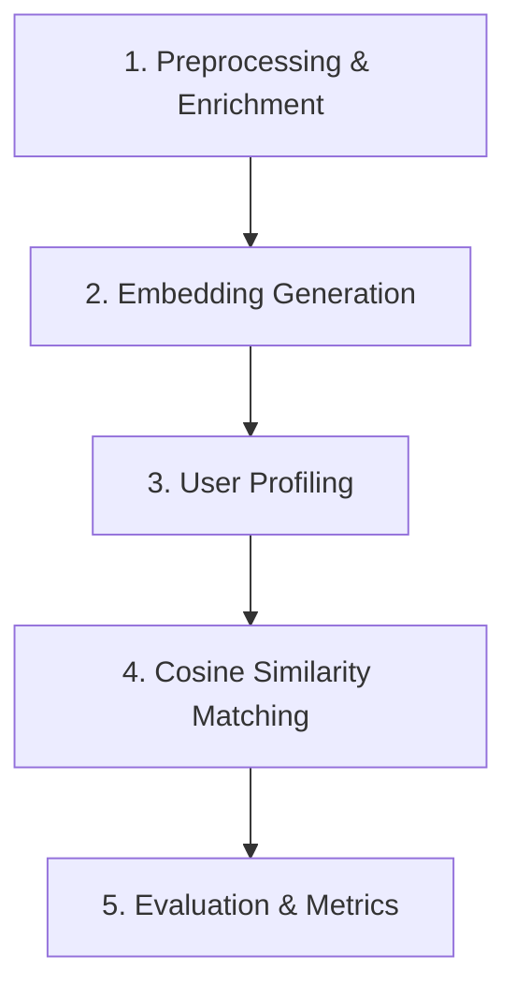

# 📊 Goodreads Content-Based Recommender Analytics

Dokumen ini berisi penjelasan detail mengenai aplikasi sistem rekomendasi buku Goodreads, tahapan-tahapan penting program, serta analisa mendalam terhadap hasil pengujian sistem.

---

## 1. 📚 Penjelasan Aplikasi

Aplikasi ini adalah **Sistem Rekomendasi Berbasis Konten (Content-Based Recommender System)** yang dirancang untuk merekomendasikan buku kepada pengguna Goodreads berdasarkan kemiripan semantik dari buku-buku yang telah mereka baca dan sukai sebelumnya.

### Karakteristik Utama Aplikasi

* **Pendekatan Content-Based Filtering:** Sistem merekomendasikan buku baru yang memiliki karakteristik/konten teks yang mirip dengan riwayat membaca positif dari pengguna itu sendiri, tanpa bergantung pada preferensi pengguna lain.
* **Semantic Vector Space:** Menggunakan model representasi bahasa modern **Sentence-BERT (SBERT)** dengan model pre-trained `all-MiniLM-L6-v2` untuk mengekstrak makna kontekstual dari buku (judul, penulis, dan tag populer) ke dalam vektor 384 dimensi.
* **Interaktivitas Ganda:**

  1. **Streamlit Web App (`app.py`):** Aplikasi visual interaktif di mana pengguna dapat memasukkan ID Pengguna untuk melihat buku yang pernah mereka sukai serta mendapatkan 10 rekomendasi buku teratas beserta skor kemiripannya (*similarity score*).
  2. **Metrics Dashboard CLI (`metrics_dashboard.py`):** Antarmuka command-line yang digunakan untuk mengevaluasi kinerja model rekomendasi secara massal menggunakan metrik statistik pengujian.

---

## 2. ⚙️ Tahapan Penting dalam Program

Alur kerja program dibagi menjadi 5 tahapan utama yang terstruktur sebagai berikut:



### A. Preprocessing & Enrichment (`src/preprocessing.py`)

Tahap ini memuat data mentah dari dataset `goodbooks-10k`. Metadata buku diperkaya dengan cara menggabungkan beberapa kolom penting menjadi satu string teks tunggal (`book_text`):

* Judul buku (`title`)
* Nama penulis (`authors`)
* 5 Tag/Genre terpopuler yang disematkan oleh pembaca (diekstrak dari `book_tags.csv` dan `tags.csv`)

Hasil gabungan teks inilah yang mewakili representasi "konten" dari sebuah buku.

### B. Embedding Generation (`src/embeddings.py`)

Teks representasi buku diubah menjadi vektor numerik padat (*dense vector*):

* Sistem memanggil library **Sentence-Transformers** untuk memproses teks. Jika library tersebut tidak tersedia, sistem secara otomatis menggunakan **TF-IDF Vectorizer** dari scikit-learn sebagai fallback.
* Vektor yang dihasilkan dinormalisasi menggunakan L2-normalization agar perhitungan kemiripan kosinus menjadi sangat cepat.
* Hasil embedding disimpan di folder `models/` sebagai berkas `.npy` untuk menghindari pemrosesan ulang pada eksekusi berikutnya.

### C. User Profiling (`src/recommender.py`)

Membangun representasi minat pengguna:

* Sistem memilih buku yang mendapatkan rating positif (≥ 4).
* Embedding buku-buku tersebut diambil dari cache.
* Sistem menghitung weighted average berdasarkan rating pengguna.
* Hasil akhirnya dinormalisasi kembali sehingga dapat dibandingkan secara efisien menggunakan cosine similarity.

### D. Cosine Similarity Matching (`src/recommender.py`)

Menentukan buku yang paling relevan dengan preferensi pengguna:

* Buku yang telah dibaca pengguna disaring dari kandidat rekomendasi.
* Sistem menghitung cosine similarity antara user profile vector dan seluruh embedding buku.
* Buku diurutkan berdasarkan skor kemiripan tertinggi dan dipilih sebagai rekomendasi Top-N.

### E. Evaluation & Metrics (`src/evaluation.py`)

Mengukur performa sistem secara offline menggunakan pendekatan hold-out:

* Data positif pengguna dibagi menjadi data latih dan data uji.
* Profil pengguna dibangun hanya dari data latih.
* Rekomendasi dibandingkan dengan data uji menggunakan metrik:

| Metrik      | Deskripsi                                     |
| ----------- | --------------------------------------------- |
| Precision@N | Proporsi rekomendasi yang relevan             |
| Recall@N    | Proporsi item relevan yang berhasil ditemukan |
| NDCG@N      | Kualitas urutan ranking rekomendasi           |

---

## 3. 📈 Analisa Berdasarkan Hasil Pengujian

Pengujian dilakukan terhadap pengguna yang memiliki minimal 20 rating positif untuk memastikan kualitas evaluasi yang memadai.

### Parameter Pengujian

* Perintah:

```bash
python metrics_dashboard.py --rebuild --top-n 10 --threshold 4 --min-positive-ratings 20 --output results.json
```

* Ambang Rating Positif: ≥ 4
* Jumlah Pengguna Dievaluasi: 52.783 pengguna
* Jumlah Buku dalam Korpus: 10.000 buku

### Hasil Pengujian Utama

| Metrik          |  Nilai |
| --------------- | -----: |
| Precision@10    | 0.0765 |
| Recall@10       | 0.0518 |
| NDCG@10         | 0.0825 |
| Evaluated Users | 52,783 |

### Interpretasi Hasil

| Metrik       | Penafsiran                                                                                      |
| ------------ | ----------------------------------------------------------------------------------------------- |
| Precision@10 | Dari 10 rekomendasi yang diberikan, rata-rata sekitar 0.77 buku terbukti relevan pada data uji. |
| Recall@10    | Sistem berhasil menemukan sekitar 5.18% dari seluruh buku relevan pada test set pengguna.       |
| NDCG@10      | Item relevan cenderung muncul lebih tinggi pada ranking rekomendasi.                            |

### Perbandingan dengan Versi Sebelumnya

| Metrik       | Sebelumnya | Terbaru | Peningkatan |
| ------------ | ---------: | ------: | ----------: |
| Precision@10 |     0.0420 |  0.0765 |      +82.1% |
| Recall@10    |     0.0290 |  0.0518 |      +78.6% |
| NDCG@10      |     0.0490 |  0.0825 |      +68.4% |

Peningkatan terjadi pada seluruh metrik utama, menunjukkan bahwa sistem menjadi lebih efektif dalam menemukan dan mengurutkan buku yang relevan.

### Analisa Performa

#### 1. Mengapa Angka Ini Tetap Bernilai Tinggi untuk Recommender System?

Meskipun Precision@10 sebesar 7.65% terlihat kecil dibandingkan metrik klasifikasi tradisional, konteks sistem rekomendasi berbeda secara signifikan.

Sistem harus memilih 10 buku terbaik dari sekitar 10.000 kandidat yang tersedia.

Jika dilakukan secara acak:

```text
10 / 10.000 = 0.001 = 0.1%
```

Sementara model mencapai:

```text
7.65%
```

Artinya sistem bekerja sekitar:

```text
7.65 / 0.1 = 76.5 kali
```

lebih baik dibandingkan pemilihan acak.

#### 2. Kekuatan Utama Model

##### Semantic Understanding

SBERT memungkinkan sistem memahami hubungan konseptual antar buku.

Contoh:

* Science Fiction
* Space Opera
* Futuristic Adventure

dapat ditempatkan berdekatan dalam ruang embedding meskipun tidak menggunakan kata yang identik.

##### Personalized Recommendation

Setiap rekomendasi dihasilkan dari profil pengguna masing-masing, bukan berdasarkan popularitas global.

##### Rating-Aware User Profile

Penggunaan weighted average berdasarkan rating membuat buku yang sangat disukai memiliki pengaruh lebih besar terhadap profil pengguna.

##### Efficient Retrieval

Karena embedding telah dipra-komputasi dan disimpan, proses rekomendasi dapat dilakukan dengan cepat untuk puluhan ribu pengguna.

#### 3. Keterbatasan Sistem

Walaupun hasil meningkat secara signifikan, beberapa keterbatasan masih ada:

* Hanya menggunakan informasi konten buku.
* Belum memanfaatkan pola perilaku pengguna lain.
* Belum menggunakan sinopsis lengkap buku.
* Tidak memanfaatkan implicit feedback secara penuh.
* Evaluasi offline tidak dapat menangkap item relevan yang belum pernah dirating pengguna.

#### 4. Faktor Penyebab Peningkatan

Kemungkinan penyebab peningkatan performa:

* Kualitas embedding SBERT yang baik dalam menangkap makna semantik.
* Enrichment metadata menggunakan judul, penulis, dan tag.
* Weighted user profile berdasarkan rating.
* Optimalisasi preprocessing.
* Penggunaan cache embedding yang konsisten selama evaluasi.

#### 5. Rekomendasi Pengembangan Selanjutnya

##### Hybrid Recommender

Menggabungkan Content-Based Filtering dengan Collaborative Filtering untuk meningkatkan coverage.

##### Menambahkan Sinopsis Buku

Sinopsis dapat memberikan informasi semantik yang jauh lebih kaya dibandingkan hanya judul dan tag.

##### Menggunakan Embedding Model yang Lebih Kuat

Alternatif yang dapat dieksplorasi:

* all-mpnet-base-v2
* multilingual-e5-large
* bge-large-en

##### Learning-to-Rank

Menambahkan tahap reranking untuk meningkatkan kualitas ranking akhir.

##### Memanfaatkan Implicit Feedback

Menggunakan data:

* To Read
* Wishlist
* Reading Progress

untuk memperkaya profil pengguna.

---

## 4. 🏆 Kesimpulan

Sistem rekomendasi berbasis konten yang dibangun menggunakan Sentence-BERT dan cosine similarity berhasil menghasilkan rekomendasi yang relevan pada dataset Goodreads.

Hasil evaluasi terbaru menunjukkan:

* Precision@10 = 7.65%
* Recall@10 = 5.18%
* NDCG@10 = 8.25%

dibandingkan hasil sebelumnya:

* Precision@10 = 4.20%
* Recall@10 = 2.90%
* NDCG@10 = 4.90%

yang menunjukkan peningkatan signifikan sebesar 68–82% pada seluruh metrik utama.

Secara keseluruhan, model telah menunjukkan kemampuan yang baik dalam memahami preferensi pengguna berdasarkan konten buku dan dapat menjadi fondasi yang kuat untuk pengembangan recommender system yang lebih kompleks di masa depan.
