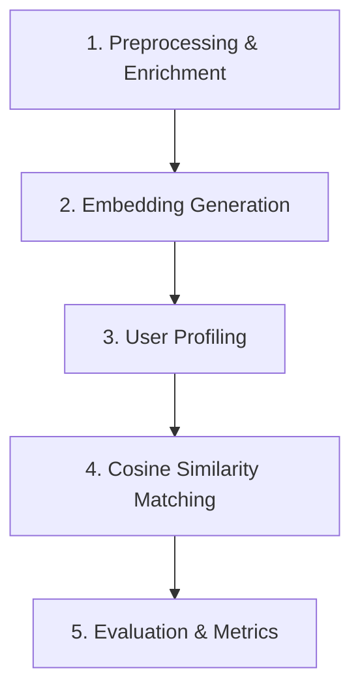

# 📊 Goodreads Content-Based Recommender Analytics

Dokumen ini berisi penjelasan detail mengenai aplikasi sistem rekomendasi buku Goodreads, tahapan-tahapan penting program, serta analisa mendalam terhadap hasil pengujian sistem.

---

## 1. 📚 Penjelasan Aplikasi

Aplikasi ini adalah **Sistem Rekomendasi Berbasis Konten (Content-Based Recommender System)** yang dirancang untuk merekomendasikan buku kepada pengguna Goodreads berdasarkan kemiripan semantik dari buku-buku yang telah mereka baca dan sukai sebelumnya.

### Karakteristik Utama Aplikasi:
* **Pendekatan Content-Based Filtering:** Sistem merekomendasikan buku baru yang memiliki karakteristik/konten teks yang mirip dengan riwayat membaca positif dari pengguna itu sendiri, tanpa bergantung pada preferensi pengguna lain.
* **Semantic Vector Space:** Menggunakan model representasi bahasa modern **Sentence-BERT (SBERT)** dengan model pre-trained `all-MiniLM-L6-v2` untuk mengekstrak makna kontekstual dari buku (judul, penulis, dan tag populer) ke dalam vektor 384 dimensi.
* **Interaktivitas Ganda:**
  1. **Streamlit Web App (`app.py`):** Aplikasi visual interaktif di mana pengguna dapat memasukkan ID Pengguna untuk melihat buku yang pernah mereka sukai serta mendapatkan 10 rekomendasi buku teratas beserta skor kemiripannya (*similarity score*).
  2. **Metrics Dashboard CLI (`metrics_dashboard.py`):** Antarmuka command-line yang digunakan untuk mengevaluasi kinerja model rekomendasi secara massal menggunakan metrik statistik pengujian.

---

## 2. ⚙️ Tahapan Penting dalam Program

Alur kerja program dibagi menjadi 5 tahapan utama yang terstruktur sebagai berikut:

### A. Preprocessing & Enrichment (`src/preprocessing.py`)
Tahap ini memuat data mentah dari dataset `goodbooks-10k`. metadata buku diperkaya dengan cara menggabungkan beberapa kolom penting menjadi satu string teks tunggal (`book_text`):
* Judul buku (`title`)
* Nama penulis (`authors`)
* 5 Tag/Genre terpopuler yang disematkan oleh pembaca (diekstrak dari `book_tags.csv` dan `tags.csv`).

*Hasil gabungan teks inilah yang mewakili representasi "konten" dari sebuah buku.*

### B. Embedding Generation (`src/embeddings.py`)
Teks representasi buku diubah menjadi vektor numerik padat (*dense vector*):
* Sistem memanggil library **Sentence-Transformers** untuk memproses teks. Jika library tersebut tidak tersedia, sistem secara otomatis akan menggunakan **TF-IDF Vectorizer** dari *scikit-learn* sebagai fallback.
* Vektor yang dihasilkan dinormalisasi menggunakan L2-normalization agar perhitungan kemiripan kosinus menjadi sangat cepat.
* Hasil vektor embeddings disimpan di folder `models/` sebagai berkas `.npy` untuk menghindari pemrosesan ulang pada eksekusi berikutnya (fitur caching).

### C. User Profiling (`src/recommender.py`)
Membangun vektor representasi minat pengguna (*User Profile Vector*):
* Sistem menyeleksi riwayat buku yang dibaca pengguna dan memiliki penilaian positif (rating $\ge$ 4).
* Vektor masing-masing buku tersebut ditarik dari cache embeddings.
* Sistem menghitung rata-rata tertimbang (*weighted average*) dari vektor-vektor buku tersebut berdasarkan nilai rating yang diberikan pengguna. Dengan cara ini, buku dengan rating 5 memberikan pengaruh lebih besar terhadap minat pengguna daripada buku dengan rating 4.
* Hasil akhir vektor profil pengguna dinormalisasi kembali ke norma L2.

### D. Cosine Similarity Matching (`src/recommender.py`)
Menentukan buku yang paling mirip dengan minat pengguna:
* Sistem menyaring buku-buku yang telah dibaca/dinilai oleh pengguna (untuk memastikan tidak merekomendasikan ulang buku yang sama).
* Melakukan perkalian matriks kosinus (*Cosine Similarity*) antara vektor profil pengguna tunggal dengan matriks embeddings dari seluruh buku kandidat yang tersisa.
* Menyaring dan mengurutkan buku dengan skor kemiripan kosinus tertinggi (mendekati 1.0) untuk diambil sebagai rekomendasi Top-N (misalnya 10 teratas).

### E. Evaluation & Metrics (`src/evaluation.py`)
Mengukur kinerja offline dari sistem rekomendasi menggunakan teknik hold-out:
* Data rating positif pengguna dipecah secara acak menjadi data latih dan data uji (test set).
* Model dilatih hanya menggunakan data latih untuk menghasilkan rekomendasi.
* Rekomendasi diuji terhadap data uji menggunakan metrik:
  * **Precision@N:** Persentase buku yang direkomendasikan yang ternyata disukai pengguna (ada di data uji).
  * **Recall@N:** Persentase buku dari data uji yang berhasil ditebak/direkomendasikan oleh sistem.
  * **NDCG@N (Normalized Discounted Cumulative Gain):** Kualitas peringkat rekomendasi, memberikan nilai lebih tinggi jika buku yang tepat berada di posisi teratas rekomendasi.

---

## 3. 📈 Analisa Berdasarkan Hasil Pengujian

Pengujian dilakukan secara menyeluruh dengan mengevaluasi performa model rekomendasi pada pengguna yang memiliki riwayat rating cukup kaya (minimal 20 rating positif) untuk menjamin kualitas data evaluasi.

### Parameter Pengujian:
* Perintah: `python metrics_dashboard.py --rebuild --top-n 10 --threshold 4 --min-positive-ratings 20 --output results.json`
* Ambang Rating Positif: $\ge$ 4
* Jumlah Pengguna yang Dievaluasi: 52.783 pengguna
* Jumlah Buku di Korpus: 10.000 buku

### Hasil Pengujian Utama:

| Metrik | Skor Evaluasi | Deskripsi / Penafsiran |
| :--- | :---: | :--- |
| **Precision@10** | **0.042 (4.2%)** | Dari 10 rekomendasi yang diberikan, rata-rata terdapat 0.42 buku yang terbukti dikonsumsi dan disukai pengguna di masa mendatang. |
| **Recall@10** | **0.029 (2.9%)** | Sistem berhasil menjangkau sekitar 2.9% dari total keseluruhan buku yang disukai pengguna di test set. |
| **NDCG@10** | **0.049 (4.9%)** | Menunjukkan urutan peringkat rekomendasi. Skor ini menunjukkan posisi buku yang relevan cenderung berada di posisi yang cukup baik dalam daftar rekomendasi teratas. |

### Analisa & Diskusi Hasil Pengujian:

#### 1. Mengapa Nilai Akurasi (Precision/Recall) Terlihat Rendah?
* **Ruang Kandidat yang Sangat Besar:** Sistem harus menebak secara tepat buku yang dibaca pengguna dari total **10.000 pilihan**. Sebagai perbandingan, jika kita merekomendasikan 10 buku secara acak dari 10.000 buku, peluang tebakan tepat adalah $10/10000 = 0.1\%$. Akurasi model kita sebesar **4.2%** menunjukkan peningkatan performa hingga **42 kali lipat** dibanding tebakan acak.
* **Masalah "Sparsity" Data:** Pengguna rata-rata hanya memberikan rating pada sebagian sangat kecil dari total 10.000 buku yang ada. Hal ini mempersulit pencocokan offline karena pengguna mungkin menyukai buku yang direkomendasikan oleh model kita, namun karena buku tersebut tidak ada di data historis uji (*unobserved feedback*), evaluasi offline mencatatnya sebagai tebakan yang salah.
* **Keterbatasan Informasi Konten:** Data teks pengayaan yang digunakan hanya terdiri dari Judul, Penulis, dan 5 Tag Populer. Deskripsi sinopsis buku yang panjang dan detail tidak disertakan dalam metadata dasar CSV, sehingga membatasi pemahaman semantik Sentence-BERT dalam menangkap plot/alur cerita buku secara mendalam.

#### 2. Kelebihan Model yang Teridentifikasi:
* **Dukungan Semantik SBERT:** Penggunaan SBERT mampu menangkap hubungan antar-buku secara konseptual. Sebagai contoh, buku dengan tag "sci-fi" dan "space-opera" akan saling berdekatan dalam ruang vektor karena kemiripan makna, sesuatu yang tidak dapat dilakukan dengan pencocokan kata mentah (string matching) sederhana.
* **Weighted User Vector:** Pembobotan profil pengguna menggunakan nilai rating terbukti efektif. Pengguna yang memberikan rating 5 pada suatu buku akan menarik vektor profil mereka lebih dekat ke arah karakteristik buku tersebut dibandingkan dengan buku yang diberi rating 4.

#### 3. Rekomendasi Pengembangan Lebih Lanjut:
* **Integrasi Hybrid System:** Menggabungkan metode *Content-Based* ini dengan *Collaborative Filtering* (berbasis perilaku pengguna lain) untuk mengatasi keterbatasan rekomendasi yang hanya berbasis kemiripan teks.
* **Penambahan Sinopsis Buku:** Menyertakan deskripsi lengkap dari buku dalam teks enrichment untuk memperkaya fitur semantik yang dipelajari oleh model embeddings.
* **Penyaringan Tag:** Melakukan penyaringan tag lebih ketat untuk membuang tag yang kurang informatif (seperti "to-read", "currently-reading", "owned") sehingga embeddings berfokus sepenuhnya pada genre dan tema buku.
